以下是项目中所有协程的完整列表，按层级分类说明。

---

## 一、Raft 层（`raft/`）

### 1. `rf.ticker()` — 计时器协程

负责驱动 Leader 心跳和 Follower 选举超时。监听两个 timer：
- `electionTimer` 超时 → 转为 Candidate，发起选举
- `heartbeatTimer` 超时 → 若为 Leader，广播心跳 [1-cite-0](#1-cite-0) 

在 `Make()` 中启动： [1-cite-1](#1-cite-1) 

### 2. `rf.applier()` — 日志应用协程

Raft 层到状态机层的桥梁。通过 `applyCond` 条件变量阻塞等待，当 `commitIndex` 更新时被唤醒，将已提交的日志条目通过 `applyCh` channel 发送给上层状态机。 [1-cite-2](#1-cite-2) 

在 `Make()` 中启动： [1-cite-3](#1-cite-3) 

### 3. `rf.replicator(peer)` — 日志复制协程（每个 peer 一个）

为每个非自身的 peer 启动一个独立协程。通过 `replicatorCond[peer]` 条件变量等待信号，被唤醒后调用 `replicateOneRound(peer)` 批量复制日志，直到该 peer 追上 Leader 的日志进度。 [1-cite-4](#1-cite-4) 

在 `Make()` 中为每个 peer 启动： [1-cite-5](#1-cite-5) 

### 4. 选举投票请求协程（匿名，每个 peer 一个）

`StartElection()` 中为每个 peer 启动一个匿名协程，并行发送 `RequestVote` RPC。收到多数票后切换为 Leader。 [1-cite-6](#1-cite-6) 

### 5. 心跳广播协程（匿名，每个 peer 一个）

`BroadcastHeartbeat(true)` 时，为每个 peer 启动一个匿名协程调用 `replicateOneRound(peer)`，发送 AppendEntries 或 InstallSnapshot RPC。 [1-cite-7](#1-cite-7) 

### 6. 快照推送协程（匿名）

`InstallSnapshot` RPC handler 中，当收到有效的快照请求后，启动匿名协程将快照消息异步推送到 `applyCh`，避免在持有锁时阻塞。 [1-cite-8](#1-cite-8) 

---

## 二、ShardKV 层（`shardkv/`）

### 7. `kv.applier()` — KV 状态机应用协程

从 `applyCh` 读取 Raft 层传来的消息，根据命令类型（`Operation`、`Configuration`、`InsertShards`、`DeleteShards`、`EmptyEntry`）分发到对应的 apply 函数。同时处理快照安装。如果是 Leader 且为当前 term 的日志，还会通过 `notifyChan` 通知等待的客户端协程。 [1-cite-9](#1-cite-9) [1-cite-10](#1-cite-10) 

### 8. `kv.Monitor(kv.configureAction, ...)` — 配置监视协程

定期轮询，仅在 Leader 上执行。检查所有分片是否都处于 `Serving` 状态，若是则向 ShardCtrler 查询下一个配置版本号，并通过 Raft 提交配置变更命令。 [1-cite-11](#1-cite-11) [1-cite-12](#1-cite-12) 

### 9. `kv.Monitor(kv.migrationAction, ...)` — 分片迁移监视协程

定期轮询，仅在 Leader 上执行。检测所有处于 `Pulling` 状态的分片，按 gid 分组后并行启动子协程（见下方 #12），从上一个配置中负责该分片的 Raft 组拉取数据。 [1-cite-13](#1-cite-13) [1-cite-14](#1-cite-14) 

### 10. `kv.Monitor(kv.gcAction, ...)` — 分片清理监视协程

定期轮询，仅在 Leader 上执行。检测所有处于 `GCing` 状态的分片，按 gid 分组后并行启动子协程（见下方 #13），通知远端 Raft 组删除已迁移的数据。 [1-cite-15](#1-cite-15) [1-cite-16](#1-cite-16) 

### 11. `kv.Monitor(kv.checkEntryInCurrentTermAction, ...)` — 空日志检测协程

定期轮询，仅在 Leader 上执行。检查当前 term 是否有日志条目，若没有则提交一条空日志，推动 `commitIndex` 前进，避免多 Raft 组间的活锁。 [1-cite-17](#1-cite-17) [1-cite-18](#1-cite-18) 

### 12. 分片拉取子协程（匿名，每个 gid 一个）

在 `migrationAction()` 中，为每个需要拉取数据的 gid 启动一个匿名协程，调用远端的 `ShardKV.GetShardsData` RPC 拉取分片数据，成功后通过 `kv.Execute` 提交 `InsertShards` 命令。使用 `WaitGroup` 等待所有拉取任务完成。 [1-cite-19](#1-cite-19) 

### 13. 分片清理子协程（匿名，每个 gid 一个）

在 `gcAction()` 中，为每个需要清理的 gid 启动一个匿名协程，调用远端的 `ShardKV.DeleteShardsData` RPC 删除数据，成功后通过 `kv.Execute` 提交 `DeleteShards` 命令。使用 `WaitGroup` 等待所有清理任务完成。 [1-cite-20](#1-cite-20) 

### 14. notifyChan 清理协程（匿名）

在 `Execute()` 中，客户端请求完成后异步启动匿名协程清理 `notifyChans` 中对应 index 的 channel，避免阻塞客户端请求以提高吞吐量。 [1-cite-21](#1-cite-21) 

### 15. RPC 监听协程（匿名）

在 `shardkv/rpc.go` 的 `rpcInit()` 中启动，循环 `Accept()` TCP 连接。 [1-cite-22](#1-cite-22) 

### 16. RPC 连接服务协程（匿名，每个连接一个）

每接受一个 TCP 连接，启动 `go rpc.ServeConn(conn)` 处理该连接上的 RPC 请求。 [1-cite-23](#1-cite-23) 

---

## 三、ShardCtrler 层（`shardctrler/`）

### 17. `sc.applier()` — 配置状态机应用协程

从 `applyCh` 读取 Raft 层传来的消息，执行 `Join`/`Leave`/`Move`/`Query` 操作到配置状态机，并通过 `notifyChan` 通知等待的客户端。 [1-cite-24](#1-cite-24) [1-cite-25](#1-cite-25) 

### 18. notifyChan 清理协程（匿名）

与 ShardKV 层类似，在 `Command()` 完成后异步清理 `notifyChans`。 [1-cite-26](#1-cite-26) 

### 19. RPC 监听协程（匿名）

在 `shardctrler/rpc.go` 的 `rpcInit()` 中启动，循环 `Accept()` TCP 连接。 [1-cite-27](#1-cite-27) 

### 20. RPC 连接服务协程（匿名，每个连接一个）

每接受一个 TCP 连接，启动 `go rpc.ServeConn(conn)` 处理该连接上的 RPC 请求。 [1-cite-28](#1-cite-28) 

---

## 总结

```mermaid
graph TD
    subgraph "Raft Layer"
        T["#1 ticker - election/heartbeat timer"]
        A["#2 applier - push committed logs to applyCh"]
        R["#3 replicator x N - batch replicate to each peer"]
        V["#4 vote request x N - parallel RequestVote RPCs"]
        H["#5 heartbeat x N - parallel AppendEntries RPCs"]
        S["#6 snapshot push - async snapshot to applyCh"]
    end

    subgraph "ShardKV Layer"
        KA["#7 applier - apply raft msgs to KV state machine"]
        MC["#8 configureAction monitor - poll config changes"]
        MM["#9 migrationAction monitor - detect Pulling shards"]
        MG["#10 gcAction monitor - detect GCing shards"]
        ME["#11 checkEntryInCurrentTerm monitor - empty log detector"]
        SP["#12 shard pull tasks x N - parallel pull per gid"]
        SG["#13 shard gc tasks x N - parallel gc per gid"]
        NC["#14 notifyChan cleanup - async channel release"]
        RL["#15-16 RPC listener + ServeConn"]
    end

    subgraph "ShardCtrler Layer"
        SA["#17 applier - apply raft msgs to config state machine"]
        SNC["#18 notifyChan cleanup"]
        SRL["#19-20 RPC listener + ServeConn"]
    end

    A -- "applyCh" --> KA
    A -- "applyCh" --> SA
    MM --> SP
    MG --> SG
```

| 编号 | 协程 | 所在文件 | 数量 | 生命周期 |
|------|------|----------|------|----------|
| 1 | `ticker` | `raft/raft.go:93` | 1 | 常驻 |
| 2 | `applier` (Raft) | `raft/raft.go:118` | 1 | 常驻 |
| 3 | `replicator` | `raft/raft_replication.go:184` | N-1 (peer数) | 常驻 |  
| 4 | 选举投票请求 | `raft/raft_election.go:23` | N-1 | 临时 |
| 5 | 心跳广播 | `raft/raft_replication.go:21` | N-1 | 临时 |
| 6 | 快照推送 | `raft/raft_snapshot.go:51` | 1 | 临时 |
| 7 | `applier` (KV) | `shardkv/server.go:122` | 1 | 常驻 |
| 8 | 配置监视 | `shardkv/server.go:97` | 1 | 常驻 |
| 9 | 迁移监视 | `shardkv/server.go:99` | 1 | 常驻 |
| 10 | GC 监视 | `shardkv/server.go:101` | 1 | 常驻 |
| 11 | 空日志检测 | `shardkv/server.go:103` | 1 | 常驻 |
| 12 | 分片拉取子任务 | `shardkv/server.go:568` | 按 gid 数 | 临时 |
| 13 | 分片清理子任务 | `shardkv/server.go:596` | 按 gid 数 | 临时 |
| 14 | notifyChan 清理 (KV) | `shardkv/server.go:360` | 按请求数 | 临时 |
| 15-16 | RPC 监听+服务 | `shardkv/rpc.go:33` | 1 + 按连接数 | 常驻/临时 |
| 17 | `applier` (Ctrler) | `shardctrler/server.go:57` | 1 | 常驻 |
| 18 | notifyChan 清理 (Ctrler) | `shardctrler/server.go:148` | 按请求数 | 临时 |
| 19-20 | RPC 监听+服务 | `shardctrler/rpc.go:30` | 1 + 按连接数 | 常驻/临时 |