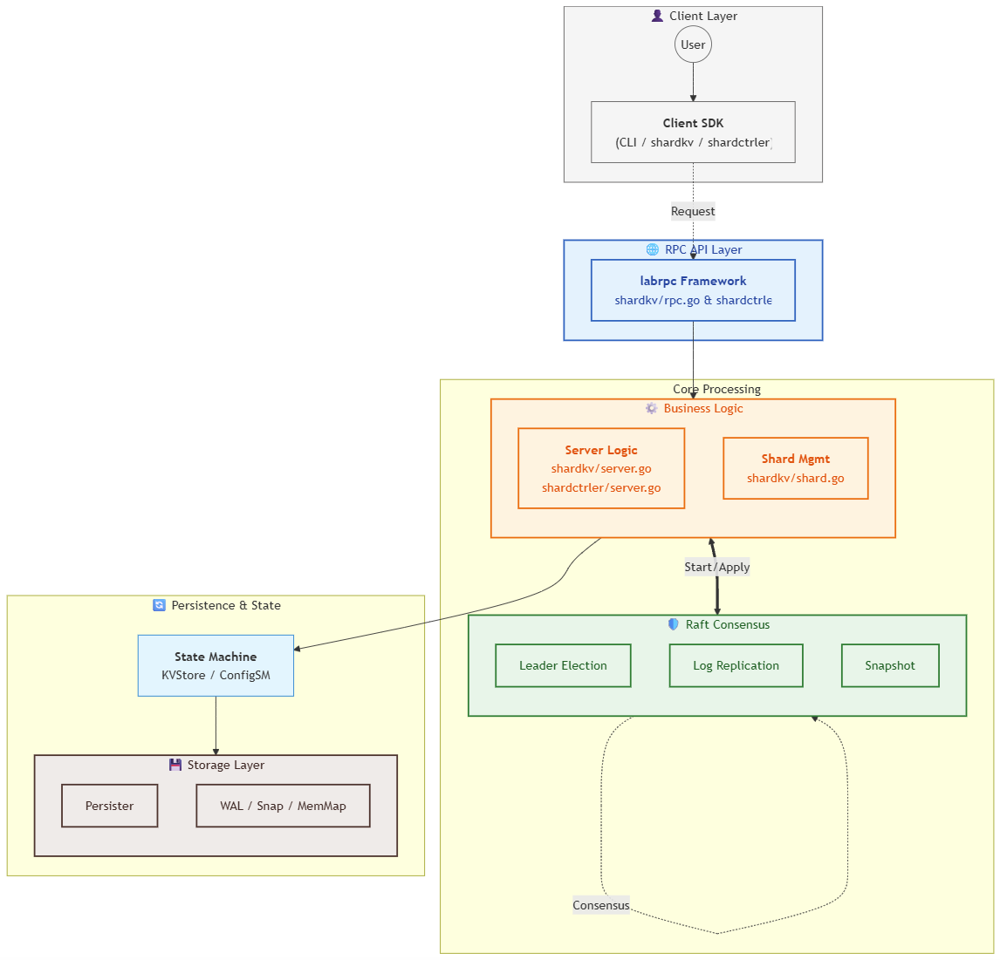

# 项目分层结构分析

根据您提供的分层标准，我对项目进行了如下分层映射：

## 1. Client 层
- **对应模块**：
  - `shardkv/client.go` - 分片KV服务的客户端实现
  - `shardctrler/client.go` - 配置服务的客户端实现
  - `main.go` 中的客户端模式代码
- **功能**：提供命令行交互界面，支持 `get`、`put`、`append` 操作，与服务端进行通信

## 2. API 层
- **对应模块**：
  - `labrpc/labrpc.go` - 自定义RPC框架，用于节点间通信
  - `shardkv/rpc.go` - KV服务的RPC定义
  - `shardctrler/rpc.go` - 配置服务的RPC定义
- **功能**：提供RPC接口，处理客户端请求，转发到逻辑层

## 3. Raft层/共识模块
- **对应模块**：
  - `raft/` 目录下的所有文件
    - `raft.go` - 核心Raft结构体
    - `raft_election.go` - 领导者选举
    - `raft_replication.go` - 日志复制
    - `raft_snapshot.go` - 快照功能
    - `raft_persist.go` - 持久化操作
- **功能**：实现Raft共识算法，确保数据一致性，处理日志复制、领导者选举等核心逻辑

## 4. 逻辑层
- **对应模块**：
  - `shardkv/server.go` - KV服务的核心业务逻辑
  - `shardkv/shard.go` - 分片管理逻辑
  - `shardctrler/server.go` - 配置服务的核心业务逻辑
- **功能**：处理业务逻辑，如分片分配、数据迁移、配置管理等

## 5. 状态机
- **对应模块**：
  - `shardkv/server.go` 中的 `apply` 方法及相关状态管理
  - `shardctrler/configStateMachine.go` - 配置服务的状态机
- **功能**：应用已提交的日志，维护服务的最终状态

## 6. 存储层
- **对应模块**：
  - `raft/persister.go` - 内存持久化实现
  - `shardkv/server.go` 中的内存KV存储
- **功能**：存储Raft状态、日志和应用状态，当前基于内存实现

## 与标准分层的差异
1. **API层**：项目使用RPC而非HTTP API，通过 `labrpc` 框架实现节点间通信
2. **存储层**：当前仅实现内存存储，未使用LevelDB或BoltDB等外部存储引擎
3. **逻辑层与状态机**：在项目中这两层耦合较紧密，未完全分离

## 分层调用流程
1. 客户端 → API层（RPC）→ 逻辑层 → Raft层（日志复制）→ 状态机 → 存储层
2. 数据变更通过Raft层复制到所有节点，确保一致性
3. 读取操作通过领导者处理，确保线性一致性

这种分层结构清晰地展示了项目的架构设计，从客户端交互到底层存储，每一层都有明确的职责和边界。